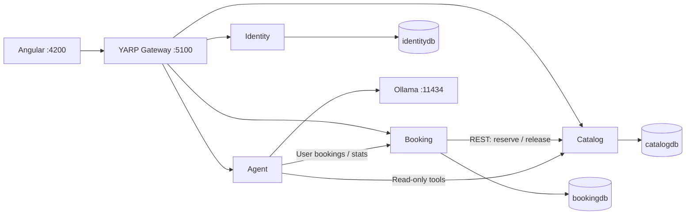

# EventHub

EventHub is a local learning project for discovering events, booking tickets and tracking organizer sales.
This guide explains how to start the system and where to find its architecture, API contracts and demo script.

Angular provides the portal; .NET services own authentication, events and bookings. A local Ollama assistant
reads service data and prepares booking/cancellation cards. Only the user's **Yes** button submits those actions.
Payments are simulated; this is a learning/demo build, with no cloud deployment or real payment integration.



All browser APIs go through the gateway. Each API validates its own JWT; roles and ownership remain enforced
when the assistant calls a tool. Each business service owns a database. Aspire starts SQL, the APIs, gateway
and Angular and collects logs/traces. Agent has no database.

## Run locally on macOS Apple Silicon

Prerequisites: .NET 10 SDK, Node.js 24 LTS with npm, Docker Desktop running with amd64/Rosetta support,
Git, and Ollama running. Allow Docker at least 4 GB memory; initial SQL startup on M1 can be slow.
Use the current project's Angular 22 CLI through npm scripts rather than requiring a global CLI.
Install/trust the .NET development certificate using `dotnet dev-certs https --trust` if your machine needs it.

Clone the repository and open its root:

```sh
git clone https://github.com/Ashwani-Tandon/eventhub.git
cd eventhub
```

For the latest local commits before they are pushed, clone from your existing project folder instead.

```sh
cd web
npm ci
cd ..
dotnet restore EventHub.sln
ollama pull qwen2.5:3b
```

On a new machine, supply the three AppHost parameters using user-secrets. Replace the placeholders locally;
choose a strong SQL password meeting SQL Server complexity rules, a random JWT key of at least 32 bytes,
and a separate random internal service credential. Never commit their values.

```sh
dotnet user-secrets set 'Parameters:sql-password' '<your-strong-SQL-password>' --project src/Aspire/EventHub.AppHost
dotnet user-secrets set 'Parameters:jwt-key' '<your-random-JWT-signing-key>' --project src/Aspire/EventHub.AppHost
dotnet user-secrets set 'Parameters:booking-service-key' '<your-random-internal-credential>' --project src/Aspire/EventHub.AppHost
dotnet run --project src/Aspire/EventHub.AppHost
```

On the existing development machine these parameters are already configured. Do not replace the SQL password
while reusing its initialized volume: changing a parameter does not change the database's saved password.
Ollama runs separately from Aspire. Confirm the selected model with `ollama list`.

Open [the portal](http://localhost:4200). Gateway is [port 5100](http://localhost:5100/identity/health).
Open the Aspire dashboard using the URL/login link printed by AppHost; its port can change.
Wait for resources to become healthy. Development startup applies committed EF migrations and seeds empty databases.
Do not start a second Angular dev server while Aspire's `web` resource owns port 4200.

| Demo login | Role |
| --- | --- |
| `attendee@demo.com`, `attendee2@demo.com` | Attendee |
| `organizer@demo.com`, `organizer2@demo.com` | Organizer |
| `admin@demo.com` | Admin |

All demo passwords: `Demo@123`. Demo accounts/data are development fixtures.

## Understand the code

Each business service has Domain (rules), Application (use cases and ports), Infrastructure (EF/HTTP/adapters),
and Api (thin endpoints and composition). Dependencies point inward. Agent has no Domain project because it
owns no business entities. Application commands change state; queries read DTOs from the same database
(CQRS-lite). Our hand-written mediator runs logging, validation and performance behaviors before handlers.
Expected failures return `Result` values mapped to HTTP ProblemDetails; mapping is explicit.

Start with these references rather than reading every file:

- [Project/layer map](docs/services/common/PROJECT_STRUCTURE.md) and [mediator / Result](docs/services/common/BUILDING_BLOCKS.md).
- [Identity](docs/services/identity/API.md), [Catalog](docs/services/catalog/API.md), [Booking](docs/services/booking/API.md), [Agent](docs/services/agent/API.md).
- [Gateway routing](docs/services/common/GATEWAY.md), [Aspire / resilience / configuration](docs/services/common/ASPIRE.md), [Angular](docs/services/common/ANGULAR.md).
- [Demo script and short answers](DEMO.md), [specification](docs/SPEC.md), [execution board](docs/EXECUTION_PLAN.md).

## Verify and rehearse

```sh
dotnet build EventHub.sln
cd web
npm run build
npm run lint
```

There are no automated tests by the owner's v1.0 decision. Runtime verification uses the browser, Aspire,
and `.http` requests beside each API. Follow [DEMO.md](DEMO.md) twice before presenting.
The execution board records what has actually been verified and what still needs owner rehearsal.

## Reset demo data deliberately

A reset deletes all local users, events and bookings. Prefer cancelling rehearsal purchases and clearing chat
when you want to retain your existing work. Restarting AppHost alone preserves data and does not reset it.

For a complete reset, stop AppHost and identify the **exact** SQL container and attached volume:

```sh
docker ps -a --format '{{.ID}} {{.Names}} {{.Image}}'
docker inspect <eventhub-sql-container-id> --format '{{json .Mounts}}'
```

Confirm the container belongs to this EventHub AppHost and note its named data volume. Remove only that
container and volume, then restart AppHost with the same configured parameters:

```sh
docker rm -f <eventhub-sql-container-id>
docker volume rm <exact-eventhub-sql-data-volume>
dotnet run --project src/Aspire/EventHub.AppHost
```

Do not use Docker prune or guess a volume name. Fresh databases are migrated and seeded by their owners;
verify the demo logins, upcoming events and sales dashboard after startup. Seed event dates are generated
for a fresh dataset; a long-lived dataset may contain events that have already started.
