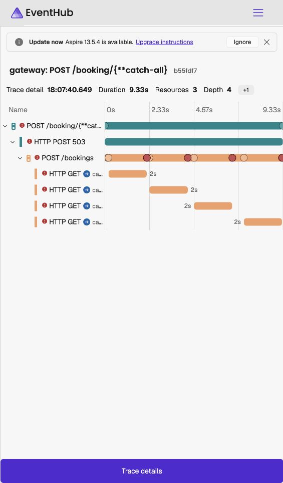
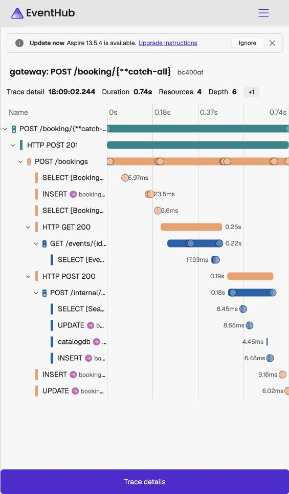

# Aspire — orchestration and shared hosting

Aspire starts the local distributed system and supplies service discovery, resource connections, and configuration.
This reference explains AppHost and ServiceDefaults, their resources and startup dependencies, and how to inspect the running application.

## AppHost: what starts and connects

Project: `src/Aspire/EventHub.AppHost`. Run from the repository root:

```sh
dotnet run --project src/Aspire/EventHub.AppHost
```

| Resource     | Responsibility                                            | Dependencies/reference wiring                         |
| ------------ | --------------------------------------------------------- | ----------------------------------------------------- |
| `sql`        | SQL Server container with persistent lifetime/data volume | Secret SQL password parameter                         |
| `identitydb` | Identity-owned database                                   | SQL Server                                            |
| `catalogdb`  | Catalog-owned database                                    | SQL Server                                            |
| `bookingdb`  | Booking-owned database                                    | SQL Server                                            |
| `identity`   | User and token APIs                                       | References/waits for identitydb                       |
| `catalog`    | Event and seat APIs                                       | References/waits for catalogdb                        |
| `booking`    | Purchase/cancellation/statistics APIs                     | References/waits for bookingdb and Catalog            |
| `agent`      | Read-only local assistant with UI action proposals                                    | References/waits for Catalog and Booking; no database |
| `web`        | Angular dev server on 4200                                | Waits for Gateway; runs `npm run start` in `web/`     |
| `gateway`    | Public entry point on 5100                                | References/waits for all four services                |

`WithReference` supplies connections/discovery configuration. `WaitFor` declares startup readiness dependencies; it is not a transaction, runtime retry policy, or guarantee a dependency will never fail later.
Booking waits for Catalog because initial development seeding reads actual event snapshots through HTTP. Each service migrates/seeds only its own database.
Persistent SQL storage survives application restarts; it must not be removed merely to apply a migration.

## Angular startup and dashboard visibility

The owner approved unified startup on 2026-09-27; NFR-01 now uses the same one-command flow as SPEC §4.
Run `npm install` in `web/` once after cloning, then the AppHost command starts both backend and frontend.
`AddExecutable("web", "npm", "../../../web", "run", "start")` runs the existing Angular start script from the
repository's `web/` folder (the working directory is relative to AppHost). Aspire owns that process lifecycle and captures
Angular's build/dev-server console output under the `web` resource. It waits for Gateway before starting.

This uses Aspire's existing executable support: no additional JavaScript integration package or npm wrapper is needed
for this local Angular CLI command. Dependency installation remains an explicit one-time setup; startup does not
silently change npm dependencies. The HTTP endpoint declares both `port` and `targetPort` as 4200 and `isProxied: false`.
Angular binds that port itself; Aspire advertises its URL without also taking the port with a second proxy.
See [Aspire's proxyless endpoint explanation](https://aspire.dev/fundamentals/networking-overview/).
Angular's existing `/api` proxy still forwards browser calls to Gateway on 5100.

In the dashboard, open Resources → `web` to see Running, `http://localhost:4200`, and console logs. Stop/restart `web`
there when working on the dev server. Do not run a second `npm start` while Aspire already owns port 4200.
The trade-offs are a shared development lifecycle (stopping AppHost stops Angular), a wait for Gateway readiness
before Angular starts, and a port conflict if a second dev server is launched manually. For independent frontend work,
stop `web` in the dashboard, then use `npm start`. A backend failure after startup does not automatically stop Angular.

Verified on 2026-09-27: solution build 0 warnings/0 errors, dashboard `web` Running with port-4200 URL, Angular build/watch
output in Console logs, and HTTP 200 from both Angular `/` and its `/api/identity/health` proxy.

These are local development server logs; registration does not automatically add browser actions to backend traces.

## Configuration and secrets

| AppHost parameter     | Supplied to                                  | Purpose                                                   |
| --------------------- | -------------------------------------------- | --------------------------------------------------------- |
| `sql-password`        | SQL resource and database connections        | SQL authentication                                        |
| `jwt-key`             | All four APIs as `Jwt__Key`                  | Shared signing/validation key                             |
| `booking-service-key` | Catalog and Booking as `BookingService__Key` | Proves trusted Booking access to internal seat operations |

Use AppHost user-secrets / Aspire parameters for values; never commit credentials to JSON or documentation.
Environment double underscores represent configuration nesting. Database references provide each service its own connection string, not permission to query another service's database.
Service ports are dynamically assigned; read them from the dashboard rather than hard-coding them. Gateway stays on 5100. Ollama uses 11434 but is not started by the current AppHost; the owner must run it before Agent usage.

The local development machine is Apple Silicon with 8 GB RAM. SQL Server runs as an amd64 container under Rosetta; initial startup can be slow.
The selected local Ollama model is `qwen2.5:3b`, chosen for that memory budget; Agent calls it through OllamaSharp and Microsoft.Extensions.AI; see the [Agent reference](../agent/API.md).

## Dashboard and operation

The startup output provides the current dashboard URL and login link. Do not copy its authentication token into permanent documents.
Resources shows service/container state and current URLs. Console and structured logs expose service output; traces show HTTP calls and timing; metrics show collected measurements.
Stop/start an individual service there to observe dependency failures without deleting data. Booking's pending cancellation can be completed after Catalog is restarted; stopping a database is a different failure scenario.

## ServiceDefaults: common API hosting, not an orchestrator

Project: `src/Aspire/EventHub.ServiceDefaults`. APIs and Gateway call shared setup rather than duplicating technical hosting configuration.

| Feature           | Current behavior                                                                                                               |
| ----------------- | ------------------------------------------------------------------------------------------------------------------------------ |
| Discovery         | Resolves outbound HTTP clients through Aspire service names                                                                    |
| Resilience        | Shared configurable total timeout → retry → circuit breaker → attempt timeout for service HTTP calls                           |
| Telemetry         | OpenTelemetry logging, ASP.NET/HTTP tracing, HTTP/server/runtime metrics; OTLP export when configured                          |
| Health            | Development-only `/health` runs registered checks; `/alive` runs checks tagged `live`; healthy gives 200, unhealthy 503        |
| Authentication    | APIs validate JWT signature, issuer `eventhub-identity`, audience `eventhub`, expiry, and HS256 algorithm with zero clock skew |
| Authorization     | Organizer policy accepts Organizer or Admin; Admin policy accepts only Admin                                                   |
| Caller context    | Implements BuildingBlocks user/profile interfaces from signed claims                                                           |
| HTTP results      | Translates Results into 200/201/204 or typed ProblemDetails; validation includes `errors`                                      |
| Unexpected errors | Logs exception details and returns a safe 500 body with trace ID instead of leaking a stack trace                              |

Health polling is excluded from normal server tracing. Health routes are not automatically authenticated. The Gateway does not call shared JWT setup; destination APIs validate tokens.
`AddEventHubResilience(dependencyName)` is the one opt-in for service clients. Booking's Catalog client and Agent's Catalog/Booking clients use the same implementation rather than copying policy code. Values bind from the caller's `Resilience` configuration section and are validated during startup.

The default pipeline is ordered outermost to innermost: a 10-second total timeout, up to 3 retries with exponential backoff from 200 ms and jitter, a breaker that opens at 50% failures with at least 5 attempts in 10 seconds, and a 2-second attempt timeout. The breaker remains open for 15 seconds. The 2-second attempt limit must be shorter than the 10-second overall budget so a slow attempt leaves time for a retry; the future 30-second Gateway budget remains outside both. Jitter spreads simultaneous retries, while the breaker stops adding traffic to a dependency that is already failing.

Retries are deliberately narrower than breaker failure detection. GET is safe. A write retries only when it carries `Idempotency-Key` or the typed client marks it idempotent; Booking marks Catalog reserve/release because their stable `reservationId` makes replays no-ops. Other POST, PUT, PATCH, and DELETE requests get one attempt. Transient connection errors, Polly timeouts, 408, 429, and 5xx count as failures. Exhausted calls and open circuits become the service's `Unavailable` Result and therefore 503 ProblemDetails with `Retry-After`, never an accidental 500.

Retry, timeout, and breaker callbacks write structured warning logs with the current W3C trace ID. In Aspire, open Booking's trace and logs together: the trace shows each outbound attempt, while matching `TraceId` fields explain retry numbers and the `opened` → `half-open` → `closed` breaker transitions. Use [`resilience.http`](../../../src/Services/Booking/Booking.Api/resilience.http): stop only Catalog, send the outage requests, restart it, wait 15 seconds, and send the recovery request. This is an operational experiment, not a production chaos endpoint.

Polly can dispatch breaker callbacks using a retained execution context. The explicit `TraceId` in our log message is captured per call: `opened` identifies the triggering failure and `closed` identifies the successful trial. `half-open` links to a retained earlier failure trace, which explains why it can differ from the recovery request's trace. Use the explicit message field for this relationship; the dashboard's ambient log context can reflect the retained request too.

The recorded outage trace has four two-second Catalog attempts (one initial call and three retries), followed by 503 in 9.33 seconds. The breaker counted attempts inside the retry layer: the fifth failed attempt opened it, and the following request returned 503 in 10.9 ms. Restarting Catalog and waiting at least 15 seconds allowed booking `308` to complete with 201 in 0.74 seconds. My Bookings still returned 200 during the outage.





Booking's `appsettings.json` contains the non-secret `Resilience` numbers shown above. Strict JSON cannot carry opening comments, so this reference explains its purpose: it configures logging, host filtering, and the shared outgoing HTTP policy for Booking. The screenshots are dashboard output, not hand-authored implementation files.

Every SQL Server DbContext sets a 15-second command timeout and enables the provider's transient execution strategy. EF automatically retries individual queries and saves. Catalog's explicit seat reserve/release transactions are wrapped in `CreateExecutionStrategy().ExecuteAsync(...)`, because a user-started transaction must be replayed as one unit rather than retrying only half of the seat operation.

The library supplies the timeout/retry/breaker machinery; EventHub supplies the policy order, safe-request gate, numbers, and business error mapping. See Microsoft's [HTTP resilience documentation](https://learn.microsoft.com/en-us/dotnet/core/resilience/http-resilience) and [EF connection resiliency documentation](https://learn.microsoft.com/en-us/ef/core/miscellaneous/connection-resiliency) for the underlying behavior.

## Boundaries

AppHost assembles resources; ServiceDefaults supplies technical API hosting; BuildingBlocks supplies application contracts; services own business behavior.
Aspire does not merge databases, implement business authorization, or automatically provide creation idempotency.
See [Gateway](GATEWAY.md), [BuildingBlocks](BUILDING_BLOCKS.md), and [project structure](PROJECT_STRUCTURE.md) for their separate responsibilities.
